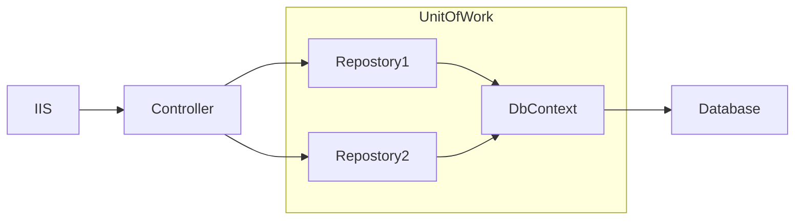
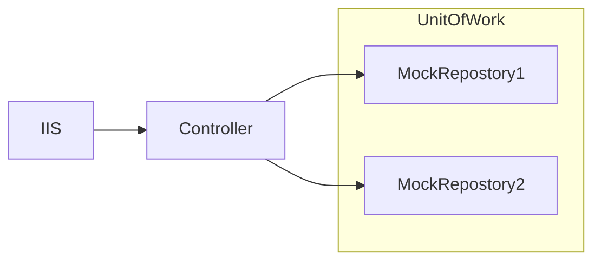
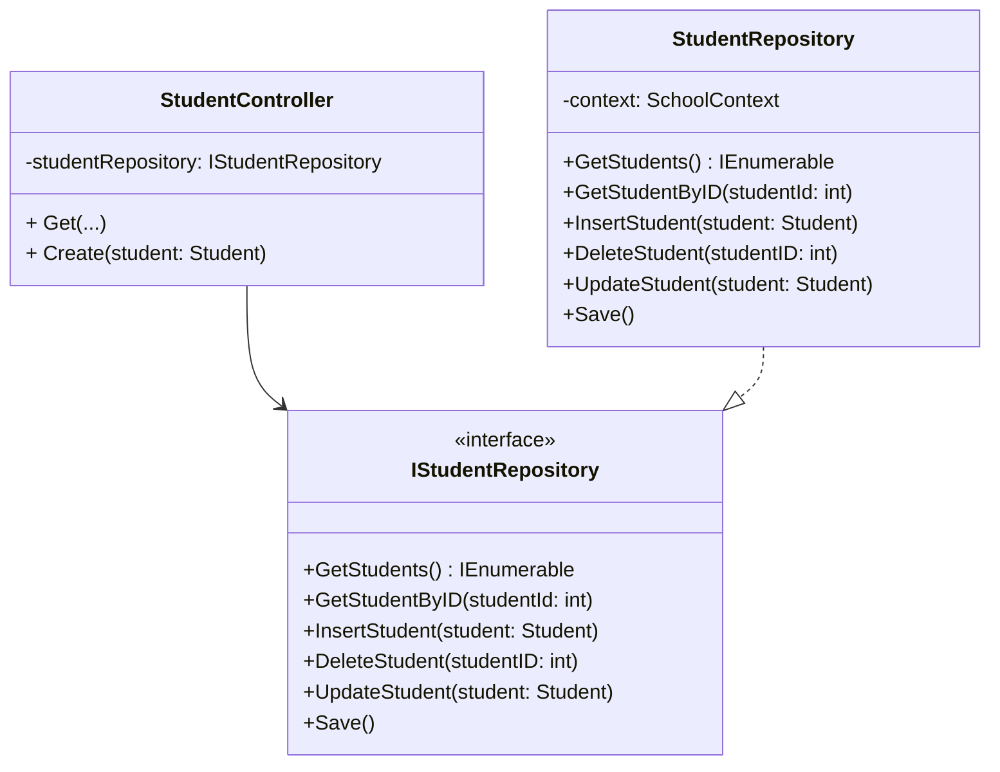
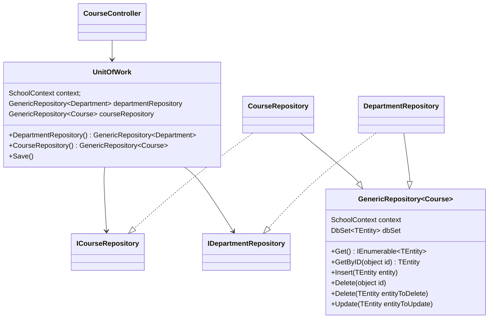

# Unit of Work Pattern


## Intent
**Unit of Work Pattern** is...

The unit of work patterns are intended to create an abstraction layer between the data access layer and the business logic layer.
Implementing these patterns can help insulate your application from changes in the data store and can facilitate automated unit testing
or test-driven development (TDD).

- When the controller runs under a web server, it receives a repository that works with the Entity Framework.
- When the controller runs under a unit test class, it receives a repository that works with data stored in a way that you can easily manipulate for testing, such as an in-memory collection.

## Problem
You could instantiate a new context in the repository, but then if you used multiple 
repositories in one controller, each would end up with a **separate context**.

How a unit of work class can ensure that all repositories use the same context.

Suppose you have to update two different entity types as part of the same transaction.
If each uses a separate database context instance, **one might succeed and the other might fail**.

**No repository**


**With repository**

**With repository in testing**


## Solution
Implement a repository class for each entity type. Repository interface and class for Student entity

Use multiple repositories and a unit of work class for the Course and Department entity types in the Course controller. 

The unit of work class coordinates the work of multiple repositories by creating a single database context class shared by all of them. 

## Structure
Implement repository pattern:


Implement unit of work pattern:


```csharp
class UnitOfWork {
  private SchoolContext context = new SchoolContext();
  private GenericRepository<Department> departmentRepository;
  private GenericRepository<Course> courseRepository;

  public GenericRepository<Department> DepartmentRepository()
  {
    if (this.departmentRepository == null)
    {
      this.departmentRepository = new GenericRepository<Department>(context);
    }
    return departmentRepository;
  }

  public GenericRepository<Course> CourseRepository() {
    // Same above
  }
}

class StudentController
{
  private IStudentRepository studentRepository;

  /// The default (parameterless) constructor creates a new context instance,
  public StudentController()
  {
    this.studentRepository = new StudentRepository(new SchoolContext());
  }

  /// Optional constructor allows the caller to pass in a context instance.
  public StudentController(IStudentRepository studentRepository)
  {
    this.studentRepository = studentRepository;
  }

  [HttpPost]
  public object Create(Student student)
  {
    studentRepository.InsertStudent(student);
    studentRepository.Save();
    return student;
  }
}
```
[Code example](https://refactoring.guru/design-patterns/abstract-factory)

## Applicability
1. Group multiple operations, that form a single unit of work.
2. Without the unit of work pattern, the repositories have to manage the transaction’s lifetime.
3. Unit of Work is an abstraction above repositories for transaction management

## Pros and Cons
**Pros**
- Data consistency, group operations together and commit or roll them back as a single unit.
- Performance, groups operations together and sends them through the wire in a batch, in
most cases it will be faster than committing transactions one by one. It is also unnecessary
to open and close multiple connections and manage new transactions one after another.

**Cons**
- Must evaluate before integrating a pattern into a specific project.
- Complexity, Introducing abstraction always increases code complexity too.
- Delayed State Changes, let’s take an example:
> Scenario where we want to create two related entities in the same transaction: an order and a payment. 
> Assume that we have database-generated IDs for both entities. In our code, when we create an order, it won’t possess an ID at that moment. 
> This is because the ID will be generated by the database, but the unit of work’s transaction has not been finalized as of now. 
>When creating a payment, we won’t be able to link it to the order, because it doesn’t have an ID yet.

 

## Relations with Other Patterns