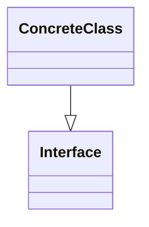

# Pattern name

## Intent
**Pattern name** is...

## Problem

## Solution

## Structure

[Code example](https://refactoring.guru/design-patterns/abstract-factory)

## Applicability

## Pros and Cons

## Relations with Other Patterns